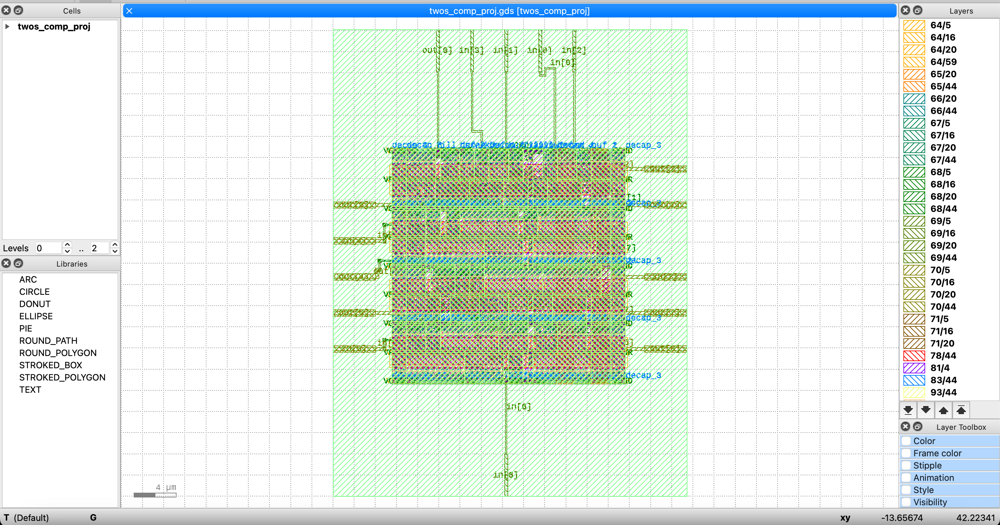

# Two's Complement - OpenLane Digital IC Project

This project implements a simple 8-bit two's complement logic circuit using the OpenLane RTL-to-GDS flow and the Sky130 PDK.

## 🔧 RTL Design

verilog
module twos_comp_proj (
    input [7:0] in,
    output [7:0] out
);
assign out = ~in + 1;
endmodule

